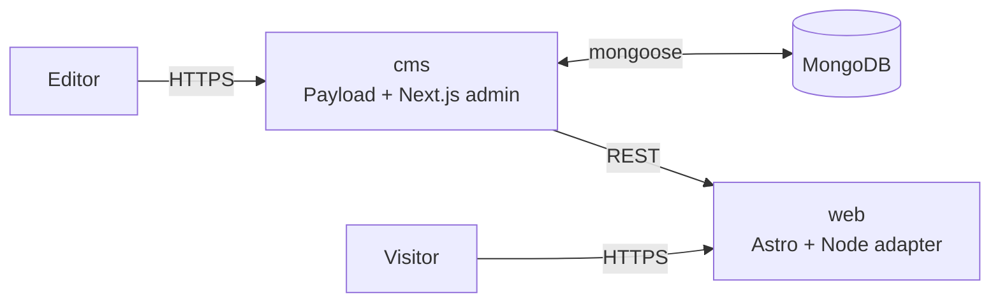

<p align="center">
  
</p>

# 🧑‍🚀 Astroload: Astro 7 + Payload Starter Template

[](https://astro.build)
[](https://payloadcms.com)
[](https://tailwindcss.com)
[](https://www.mongodb.com)
[](https://pnpm.io)
[](../LICENSE)
[](#contributing)

Astroload is an Astro 7 + Payload CMS starter template, built as a pnpm workspace on MongoDB. It includes live preview, single- or multi-locale routing, SEO output, S3 storage, forms with basic spam checks, build-time redirects, deploy webhooks, and a typed CMS data layer with LRU caching.

> [!NOTE]
> This template is in active development and in production use. The API, content model, and project structure may still change between releases. Pin a tag or commit if you build on top of it. Changes per release are tracked in [`astroload/CHANGELOG.md`](./astroload/CHANGELOG.md).

## Features

### Content and CMS

- Page builder with rich text, image, form, and dynamic posts/authors list blocks
- Drafts and autosave on Pages, Posts, and Authors
- Role-based access (`admin`, `editor`) plus separate API keys for read-only and preview reads. The Astro side uses these scoped keys, so `web/.env` holds no admin-capable Payload token
- Editor-managed Header, Footer, Labels, and SiteSettings globals
- Seed script for an admin user, API keys, and demo content

### Frontend rendering

- Astro 7 with prerendered pages in production. Dev renders on demand so CMS edits show up without restarts
- Tailwind v4 via `@tailwindcss/vite`, no PostCSS layer
- View transitions via `<ClientRouter />`
- Lexical rich text with custom block and upload renderers
- Typed data layer backed by an LRU cache, bypassed in dev and for preview reads

### Live preview

- Autosave-driven preview on Pages, Posts, and Authors
- Mobile, tablet, and desktop breakpoints preconfigured in the admin
- Editor toolbar overlay on the standalone preview tab, hidden inside the Payload iframe
- Preview route guarded by a shared secret with `crypto.timingSafeEqual`, served with `Cache-Control: no-store`, `X-Robots-Tag: noindex, nofollow`, and `Referrer-Policy: no-referrer`

### SEO and i18n

- Configurable locale set (`en` and `de` by default). With more than one locale, URLs carry a `/{locale}` segment and content pages get `hreflang` plus `x-default` alternates (error and root pages carry none)
- With a single locale the prefix is omitted, so URLs read `/about` rather than `/en/about`, and the switcher and alternates are off. A single-locale project that may add languages later can set `FORCE_URL_PREFIX` in `cms/src/site-config.ts` to keep the `/{locale}` prefix. URLs then stay the same when a locale is added and need no redirects
- Editable SEO metadata (title, description, image) on Pages, Posts, and Authors, with fallbacks
- JSON-LD output: `WebSite` and `Organization` on home, `Article` on posts, `Person` on authors
- Sitemaps with `lastmod`: a single sitemap for unprefixed single-locale builds, otherwise a sitemap index plus per-locale sitemaps with alternate-locale links
- `robots.txt` controlled by a SiteSettings toggle so staging stays out of search
- Language switcher in the header when more than one locale is configured

### Forms and spam protection

- Form builder with text, email, number, textarea, select, checkbox, and message fields
- Client-side submission to the CMS endpoint (JavaScript required)
- Hidden honeypot field plus a minimum-submit-time check, both stripped server-side

### Operations

- Build-time redirects fetched from a `Redirects` collection, no runtime hop
- Deploy webhook (`DEPLOY_HOOK_URL`) for any plain endpoint. Repeated edits are throttled to at most two webhook calls per five-minute window
- Optional S3 storage, on when its env vars are set. Without it, uploads go to the local filesystem under `cms/media/`
- Optional Resend email, on when its env vars are set. Without it, emails are logged to the console
- Optional Umami analytics, Cloud or self-hosted: cookieless, proxied through first-party routes so content blockers that match the Umami hostnames miss it
- Locale-aware custom 404 and 500 pages

## Stack

- Astro 7 with the Node adapter (`@astrojs/node`)
- Payload 3 on Next 16 and React 19
- MongoDB 8 via `@payloadcms/db-mongodb`, standalone (transactions disabled). Postgres remains available as a documented alternative, see [`astroload/maintenance.md`](./astroload/maintenance.md)
- Tailwind CSS v4 via `@tailwindcss/vite`
- TypeScript 5.7
- pnpm 10 workspaces
- Node `>=22.12` (see `.nvmrc` for the pinned version)

## Quickstart

Prerequisites: Node `>=22.12` (see `.nvmrc`), pnpm `>=9`, Docker. The package scripts assume a POSIX shell, so on Windows run them under WSL or Git Bash.

```bash
# 1. Get the code
git clone https://github.com/woerndl/astroload.git
cd astroload

# 2. Install dependencies
pnpm install

# 3. Start local MongoDB
docker compose up -d

# 4. Set up env files
cp cms/.env.example cms/.env
cp web/.env.example web/.env
# In cms/.env, set PAYLOAD_SECRET      (openssl rand -base64 32)
# In both files, set the same PREVIEW_SECRET  (openssl rand -hex 32)

# 5. Seed the database (creates admin user, API keys, demo content)
pnpm --filter @astroload/cms seed
# The seed prints PAYLOAD_READ_KEY and PAYLOAD_PREVIEW_KEY.
# Paste both into web/.env.
```

The seed creates an admin user `admin@example.com` / `admin1234` unless
`PAYLOAD_ADMIN_EMAIL` and `PAYLOAD_ADMIN_PASSWORD` are set in `cms/.env`.
Change the password before the instance is reachable.

Then run the two dev servers in separate terminals:

```bash
# Terminal 1: Payload admin at http://localhost:3000/admin
pnpm --filter @astroload/cms dev
```

```bash
# Terminal 2: Astro site at http://localhost:4321
pnpm --filter @astroload/web dev
```

Once users exist, re-seeding needs `--force` or `SEED_FORCE=1`, which clears the seeded collections and recreates users, API keys, and demo content.

## Environment

Variables are declared in `cms/.env.example` and `web/.env.example`, which are the source of truth.

### CMS (`cms/.env`)

- `DATABASE_URI` MongoDB connection string. The docker-compose service uses `mongodb://127.0.0.1:27330/astroload`.
- `PAYLOAD_SECRET` admin session secret.
- `SERVER_URL` origin the admin is served from. Must match the browser origin for CSRF checks.
- `WEBSITE_URL` Astro frontend origin used by `generatePageURL`.
- `PREVIEW_SECRET` shared secret for the `/preview` route. Must match `web/.env`.
- `DEPLOY_HOOK_URL` optional. Any plain webhook endpoint.
- `RESEND_API_KEY`, `RESEND_FROM_ADDRESS`, `RESEND_FROM_NAME` optional.
- `S3_BUCKET`, `S3_ENDPOINT`, `S3_REGION`, `S3_ACCESS_KEY_ID`, `S3_SECRET_ACCESS_KEY` optional.

### Web (`web/.env`)

- `PAYLOAD_READ_KEY`, `PAYLOAD_PREVIEW_KEY` minted by the seed.
- `PREVIEW_SECRET` matches the CMS value.
- `CMS_URL`, `WEBSITE_URL` origins.
- `UMAMI_WEBSITE_ID` optional.
- `CMS_URL`, `WEBSITE_URL`, and `UMAMI_WEBSITE_ID` are public values baked in at build time, see [Deployment](#deployment).

## Architecture



Two Node processes, one MongoDB database. `cms/` owns the admin, the API, and the schema. `web/` reads from the CMS over HTTP at build time (for prerendered pages and redirects) and at request time (for `/preview` and any opted-in SSR route). See [`astroload/architecture.md`](./astroload/architecture.md) for the longer version.

```
.
├── cms/                  Payload application (admin and REST API)
├── web/                  Astro frontend (public site and /preview)
├── docker-compose.yml    Local MongoDB
└── pnpm-workspace.yaml
```

## Deployment

Both apps are Node servers with no serverless adapter or provider-specific build step, so a plain Node host is enough. For containers, each app has a Dockerfile and `deploy/docker-compose.production.yml` is a scaffold to copy. See [`astroload/deployment.md`](./astroload/deployment.md).

### CMS

- `pnpm --filter @astroload/cms build` then `pnpm --filter @astroload/cms start`.
- Needs `DATABASE_URI`, `PAYLOAD_SECRET`, `SERVER_URL`, `WEBSITE_URL`, `PREVIEW_SECRET` at runtime. Boot aborts with one consolidated error listing any that are missing.
- S3 and Resend turn on when their env vars are set.
- There is no bundled rate limiter. Rate limiting belongs at the edge or in a proxy in front of the CMS, see [`astroload/security.md`](./astroload/security.md).

### Web

- `pnpm --filter @astroload/web build` then `pnpm --filter @astroload/web start`. The `start` script binds `0.0.0.0:4321` by default. `HOST` and `PORT` override that, and container hosts usually inject them.
- `CMS_URL`, `WEBSITE_URL`, and `UMAMI_WEBSITE_ID` are `astro:env/client` public values, inlined into the output at `astro build`. The web app must be built with the production values. Injecting them only at `start` has no effect.
- The Astro standalone server does not auto-load `.env`, unlike the CMS's `next start`. The host injects the runtime server vars (`PAYLOAD_READ_KEY`, `PAYLOAD_PREVIEW_KEY`, `PREVIEW_SECRET`, plus `UMAMI_HOST_URL` for a self-hosted Umami). For local production testing, export them or run `node --env-file=.env ./dist/server/entry.mjs`.
- Content pages, the sitemap index, and `robots.txt` are prerendered. The per-locale sitemaps and the `/preview` route are SSR, so the CMS must stay reachable for them at runtime. A client-side script POSTs form submissions as JSON to Payload's `/api/form-submissions` endpoint, so `web/` needs no submission route. Submission requires JavaScript.
- `astro build` reads redirects from the `Redirects` collection through the CMS REST API. The CMS must be reachable during build.
- The Node server sends uncompressed responses. gzip or brotli comes from the host's proxy or CDN, and [`astroload/maintenance.md`](./astroload/maintenance.md) shows how to verify it. A host that does not compress needs a compressing proxy in front.

### Deploy webhook

- Setting `DEPLOY_HOOK_URL` in the CMS fires a POST when published content changes or is deleted, when Media, Forms, or Redirects change, or when any global changes. Works with Railway, Vercel, Coolify, or any plain webhook endpoint as-is. A burst of edits triggers one immediate call plus at most one trailing call per five-minute window while edits continue. See `cms/.env.example` for URL shapes and `docs/astroload/maintenance.md` for how long publishes take to go live and for using `CONTENT_BUILD_ID` to avoid stale build caches.

## Contributing

Issues and pull requests are welcome. Run `pnpm lint`, `pnpm check`, and `pnpm test` before opening a PR.

## Acknowledgements

- [`jhb-software/payload-astro-website-template`](https://github.com/jhb-software/payload-astro-website-template) for the starting reference.
- [`@jhb.software/payload-pages-plugin`](https://github.com/jhb-software/payload-plugins) for the URL tree.
- [`@jhb.software/astro-payload-richtext-lexical`](https://github.com/jhb-software/payload-plugins) for Lexical rendering.
- [`astro-seo-schema`](https://github.com/codingcatdev/astro-seo-schema) for JSON-LD output.

## License

[MIT](../LICENSE) © Alexander Wörndl
