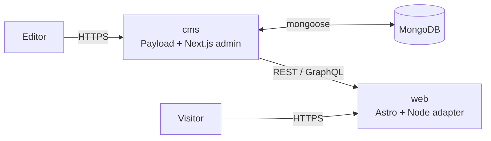

# Architecture

Astroload is a pnpm workspace with two applications that run as separate
Node processes:

- `cms/` is the Payload application. It owns the admin UI, the REST and
  GraphQL APIs, the database schema, and the editorial workflow.
- `web/` is the Astro frontend. It reads from the CMS over HTTP and renders
  the public site.

The two processes share nothing at runtime. They share types at build time
through generated TypeScript and a small SDK layer.

## Service boundaries

Calls go over HTTP even in dev, so neither side may assume single-process
semantics. The Astro app holds no database connection. Either side can be
replaced as long as the API shape is preserved.

The boundary is also as thin as it looks: blocks an editor composes in
Payload render through components the Astro app types directly from the
generated `payload-types.ts` (`SectionBlock.astro`,
`lexical/BlockRenderer.astro`). There is deliberately no adapter or
view-model layer between the two apps. Such a layer restates every CMS
type by hand, drifts from the schema on the first collection change, and
doubles the surface every change has to cross. When a shape needs
massaging, do it in the CMS response (a hook or an endpoint) or in the
component that consumes it, never in a translation layer between them.

## How content reaches the public site

The frontend reads content in three modes:

1. Build-time, prerendered. The localized content catch-all, the
   sitemap index, and `robots.txt` are generated by `astro build`.
   Updating them on the live site requires a redeploy. A deploy webhook
   (`DEPLOY_HOOK_URL`) fires from the CMS on publish so the redeploy can
   be automatic.
2. Request-time, SSR. The `/preview` route, the per-locale sitemaps, and
   any route that opts in with `prerender = false` runs on each request. Editor previews go through
   this path so changes appear without a redeploy. A public route can opt
   in the same way to stay always-current. With the `staleOnError` helper
   it serves the last good response when the CMS is unreachable, so the
   outage degrades that one route instead of failing it. On a cold start
   with nothing cached yet the request surfaces the error as usual. See
   [`conventions.md`](./conventions.md) for the freshness classes.
3. Astro config evaluation. Redirects are fetched from the CMS once when
   `astro.config.mjs` is evaluated. The result is baked into the server
   manifest, so request-time has no extra round-trip. See
   [`maintenance.md`](./maintenance.md) for the dotenv import detail this
   requires.

## Scoped API keys and the preview gate

The frontend never uses an admin-capable Payload token. There are two
scoped API keys instead:

- A read-only key the public renderer uses. It cannot read drafts and
  cannot write. A leak reveals already-public content.
- A preview-scoped key the `/preview` route uses on the server. It can
  read drafts but cannot write.

In addition, the `/preview` route is gated by `PREVIEW_SECRET`, a value the
CMS and the Astro app both know. The secret authorizes access to the
preview route itself. The API key authorizes access to draft data through
the CMS. The two are separate on purpose. See [`security.md`](./security.md)
for the threat model around each.

## Optional integrations are env-gated

The S3 storage plugin loads only when `S3_BUCKET` and credentials are
set. Without them, uploads land on local disk under `cms/media/`. The
Resend email adapter is gated the same way on `RESEND_API_KEY` and
`RESEND_FROM_ADDRESS`. Without them, Payload falls back to
console-logging outgoing email. Both branches live in
`payload.config.ts`.

## Localization runs through the URL

Content is localized in Payload. Slugs, titles, excerpts, role and bio
fields, media alt and caption, form intro content, and rich text bodies
all carry per-locale values where the relevant collection defines them.
The Astro routes are shaped as
`[lang]/<path>` with `lang` constrained to the configured locales.
Content pages emit `hreflang` per locale and an `x-default` pointing at
the configured default locale. The error pages and the root redirect do
not, because they have no per-locale counterpart to point at.

A project that ships a single locale drops the `[lang]` segment entirely.
Pages serve at `/<path>`, the root serves the home page directly with no
redirect, and pages emit a plain canonical link with no `hreflang`. The
CMS still stores the `/{locale}` path, and the web ingress normalizes it
away, so this is a config switch rather than a content change. A
single-locale project that expects to add locales later can instead keep the
prefix via `FORCE_URL_PREFIX` (see [`maintenance.md`](./maintenance.md)).

The default locale and the shipped locale set live in one module,
`cms/src/site-config.ts`, which the Payload config and the Astro side both
read. See [`maintenance.md`](./maintenance.md) for how the single source is
wired and the import-time check that guards it.

## What we give up by decoupling

Running the CMS and the frontend as separate processes has costs. The
ones that show up most in this starter:

- No in-process revalidation. A Next.js + Payload setup can call
  `revalidatePath` from an `afterChange` hook and the next request sees
  the change. Astroload cannot. Static pages need a redeploy, which the
  deploy webhook automates.
- Two deploys to coordinate. A schema change that affects the frontend
  shape lands in two repos worth of effort even though there is one
  repository. Type regeneration is part of the dev loop.
- Cross-origin everywhere. The admin runs on one origin and the public
  site on another, so live preview, form submissions, and any
  browser-to-CMS request crosses an origin boundary. CORS and cookie
  scoping are explicit.
- A more involved editor preview. The in-process iframe preview Payload +
  Next.js has by default is not free here. Astroload pairs Payload
  autosave with an iframe reload, plus a standalone `/preview` SSR
  route for sharing draft URLs. Updates appear after each autosave
  cycle. Acceptable for editorial work, not as tight as a
  single-process setup.
- No shared component bundle between admin and frontend. The admin
  renders in React, the frontend in Astro, so the Next.js + Payload
  monorepo pattern of importing the same React component from both does
  not apply here.

## Rich text on the frontend

Payload stores rich text in Lexical's tree format. The Astro side renders
it with a separate package because Payload's official Lexical renderer is
React-only and does not work inside `.astro` files. Custom block and upload
renderers live next to the wrapper component. The supported inline blocks
are tracked in [`maintenance.md`](./maintenance.md).

## Multi-tenant is deferred

The template is single-tenant. The collections, the access helpers, and
the frontend's `WEBSITE_URL` handling are kept simple so a future
`tenant` field is an additive change rather than a rewrite. Concretely:
access logic lives in helpers under `cms/src/access/` (one place to add
a tenant filter), slugs are plain fields (a compound `(slug, tenant)`
index can be added later), and the frontend reads `WEBSITE_URL` without
parsing or routing on it (a host-to-tenant resolver can replace the
env-read at a few callsites).

If you fork the template for a single site, ignore this layer. If you
have a multi-site project in mind, plan the tenancy migration before you
introduce shapes that fight it (per-collection hardcoded tenant
assumptions, host parsing in routing, slug uniqueness as a single-tenant
DB constraint).
